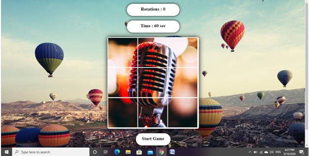
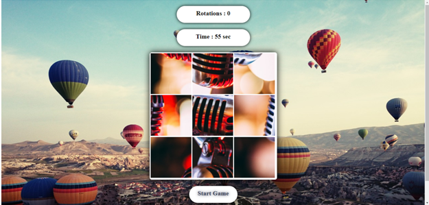
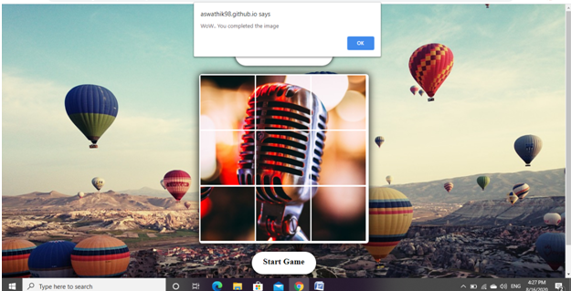
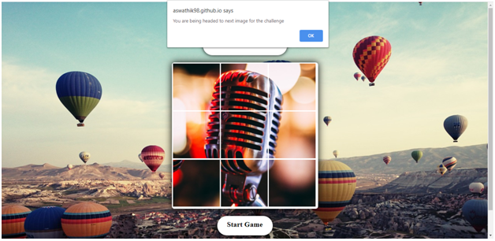
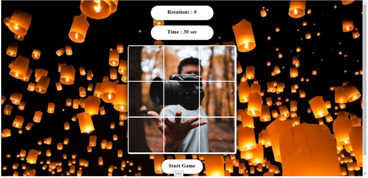
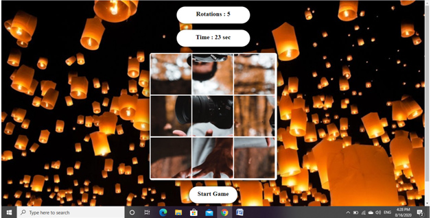
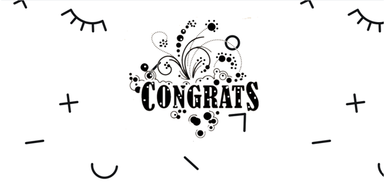

# :puzzle  Image Puzzle
* Project completed within a week . 
* The user has to rotated the respective tiles to get the respective image within the given time.
* Created with the help of HTML5,CSS,Javascript.

## Screenshots
  
 

## Link
Click the link below to play the game : 
<a href ="https://aswathik98.github.io/puzzle-image/ ">https://aswathik98.github.io/puzzle-image/</a>
